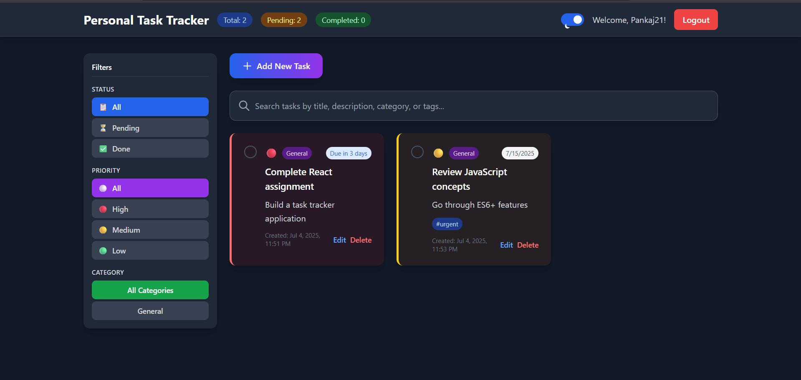

# Personal Task Tracker

##  Description

A modern and responsive task manager built with **React** and **Tailwind CSS**. Easily add, edit, filter, and organize your tasks with priority, due dates, tags, and dark mode.

##  Features

-  Username-based login  
-  Add, edit, delete, complete tasks  
-  Search & smart filters (priority, status, category)  
-  Priority levels: Low → High
-  Due dates with picker  
-  Dark mode with toggle  
-  Real-time task stats  
-  LocalStorage persistence  

##   Setup Instructions

### Prerequisites
- Node.js (version 14 or higher)
- npm or yarn package manager

### Installation Steps

1. Clone repo
`git clone https://github.com/pankaj-0301/Task-tracker.git`

2. Install dependencies
`npm install`

 3. Start dev server
 `npm run dev`
 

 4. Open your browser
 `Navigate to http://localhost:5173/`

##  Technologies Used

React + Vite

Tailwind CSS

## Live Demo 

